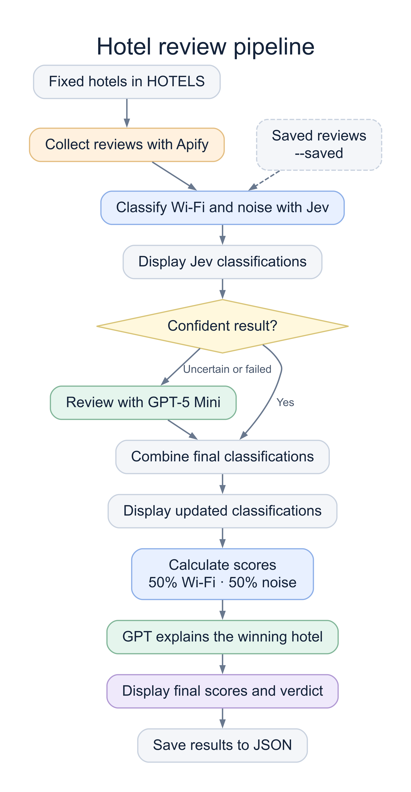

# Hotel review demo

One script: collect reviews with [Apify](https://apify.com) → classify with Jev → send uncertain or failed cases to GPT → print the best hotel and its explanation.

Results appear as each stage finishes: Jev's confident classifications first, the combined classifications after GPT Mini reviews uncertain cases, then the final scores and winner after the verdict is ready. Tables are flushed immediately so they also appear promptly when output is redirected.

Python 3.9+ is required; no packages need to be installed. Clone the repository, then configure `APIFY_TOKEN` and `OPENROUTER_API_KEY` in a local `.env` file or your environment.

```sh
git clone https://github.com/svpino/hotel-reviews.git
cd hotel-reviews
python3 hotels.py --reviews 1000
```

To reuse the saved reviews and avoid [Apify](https://apify.com) costs:

```sh
python3 hotels.py --saved
```

This reruns Jev, GPT review, and the verdict; model costs still apply. Only the OpenRouter key is required. Add `--reviews 100` to use a smaller sample; the complete saved review pool is preserved for later runs. Without a count, all saved reviews for the current `HOTELS` list are used.

The script also reads `.env` from the parent directory. Environment files, collected reviews, and generated results are excluded from Git.

Edit `HOTELS` at the top of `hotels.py` to choose hotels in any destination. Only those hotels are considered. The GPT model is `openai/gpt-5-mini` through OpenRouter, configured in `GPT_MODEL`.

`--reviews` is the target total of reviews **with text** across all hotels. Collection fetches extra to allow for rating-only reviews, then selects across hotels. If fewer are available, it reports the shortfall. [Apify](https://apify.com) has a $10 collection cap; Jev and GPT usage are billed separately.

Jev handles confident decisions. Reviews with an unclear label, confidence below 0.9, or an API error go to GPT, which reclassifies both topics from the original text. The table combines the final labels, shows how many reviews went to GPT, and flags anything still unresolved. No mention is not evidence of a good experience.

The ranking weights Wi-Fi and noise **50/50**. Each topic scores `100 × (positive + 1) / (positive + complaints + 2)`; the added counts soften very small samples. The hotel score is the average of the two topics. Both topics need at least one explicit positive or negative mention to rank. Ties are reported as joint winners; if no hotel has enough evidence, the demo says so. This is a simple ranking rule, not a measured probability that a hotel is good.

GPT explains the computed winner using the final counts, including sparse evidence and unresolved cases. It cannot change the ranking or consider price, location, or hotels outside `HOTELS`. The verdict is a best-supported pick from these sampled reviews, not a guarantee.

Review text, both models' responses, costs, errors, scores, and the verdict are saved in `data/results.json`, replaced on each run. API keys stay out of that file.

API references: [GPT-5 mini on OpenRouter](https://openrouter.ai/openai/gpt-5-mini), [structured responses](https://openrouter.ai/docs/guides/features/structured-outputs).

## Pipeline



## Tests

```sh
python3 -m unittest discover -s tests -v
```
